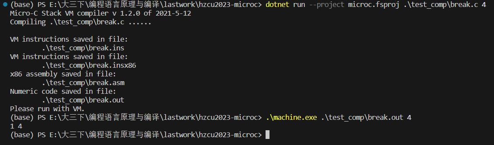
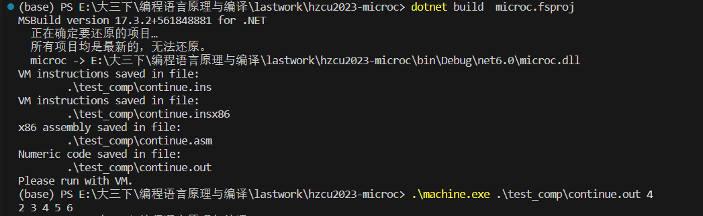
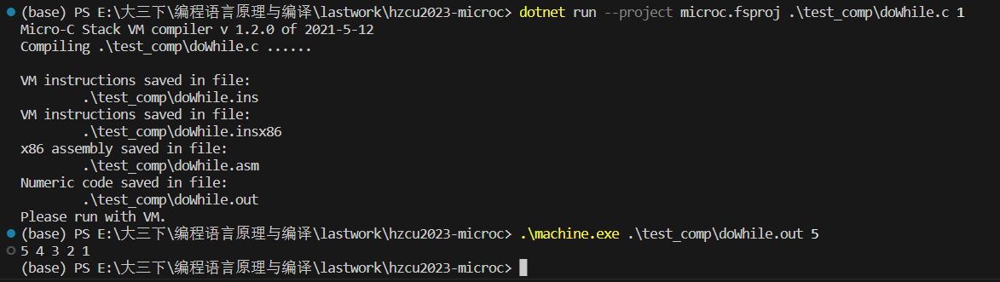
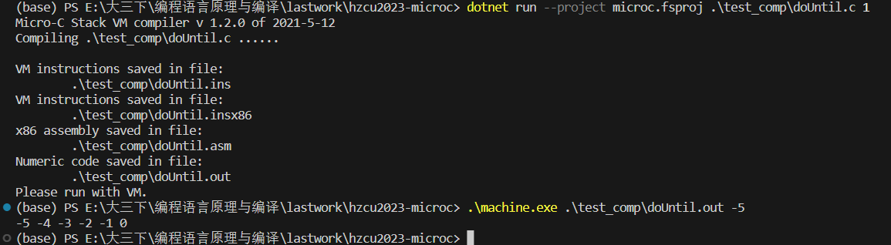
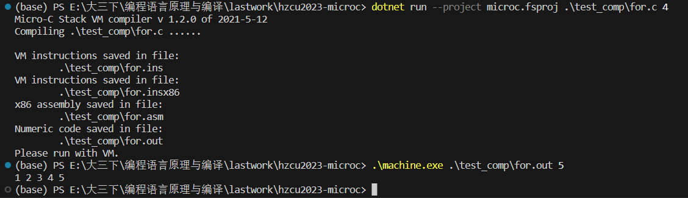
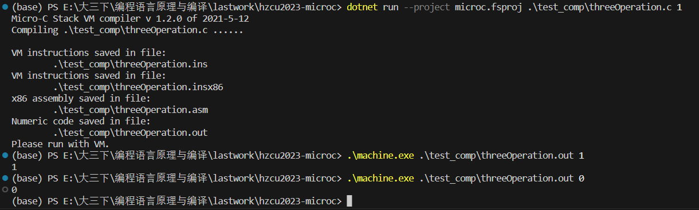
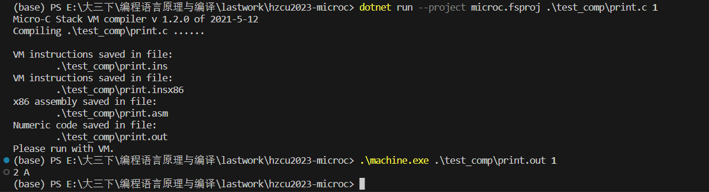
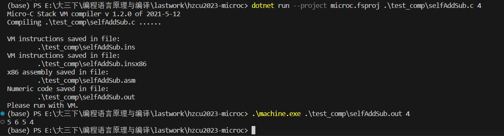
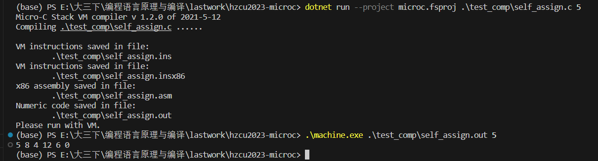

# **2022-23学年第2学期**

## **实 验 报 告**

{width="1.5208333333333333in" height="1.5208333333333333in"}

- 课程名称: <u>编程语言原理与编译</u>
- 实验项目: <u>期末大作业</u>
- 专业班级: <u>计算机2004</u>
- 学生学号: <u>32003007</u> <u>32004151</u>
- 学生姓名: <u>姜土根</u> <u>徐韩</u>
- 实验指导教师: <u>郭鸣</u>

| 姓名   | 学号     | 班级       | 任务                                   | 权重 |
| ------ | -------- | ---------- | -------------------------------------- | ---- |
| 姜土根 | 32003007 | 计算机2004 | 解释器(主要)、编译器(次要)、测试、文档 | 1.0  |
| 徐韩   | 32004151 | 计算机2004 | 编译器(主要)、解释器(次要)、测试、文档 | 0.9  |

成员代码提交日志


### 1. 项目自评等级:(1-5) 请根据自己项目情况填写下表

（完善程度：个人认为实现的完善程度，个人花费的工作量等
	难度：实现的困难程度，工作量大小，老师定义的困难程度等

| 解释器        | 完善程度 | 难度 | 备注                         |
| ------------- | -------- | ---- | ---------------------------- |
| 三元运算符 ?: | ⭐⭐⭐⭐     | 1    | test_interp/threeOperation.c |
| bool类型      | ⭐⭐⭐⭐     | 2    | test_interp/print.c          |
| char类型      | ⭐⭐       | 1    | test_interp/print.c          |
| float类型     | ⭐⭐⭐⭐     | 2    | test_interp/print.c          |
| string类型    | ⭐⭐⭐⭐     | 2    | test_interp/print.c          |
| for语句       | ⭐⭐⭐      | 2    | test_interp/for.c            |
| +=等语法糖    | ⭐⭐⭐⭐⭐    | 1    | test_interp/self_assign.c    |
| dowhile语句   | ⭐⭐⭐      | 1    | test_interp/dowhile.c        |
| dountil语句   | ⭐⭐⭐      | 1    | test_interp/dowhile.c        |
| print格式输出 | ⭐⭐       | 1    | test_interp/print.c          |
| sizeof        | ⭐⭐⭐      | 2    | test_interp/sizeof.c         |
| typeof        | ⭐⭐⭐⭐     | 2    | test_interp/typeof.c         |
| switch        | ⭐⭐⭐⭐     | 3    | test_interp/switch.c         |
| 自增自减      | ⭐⭐       | 1    | test_interp/selfAddSub.c     |


| 编译器        | 完善程度 | 难度 | 备注                       |
| ------------- | -------- | ---- | -------------------------- |
| break         | ⭐⭐⭐⭐     | 2    | test_comp/break.c          |
| continue      | ⭐⭐⭐⭐     | 2    | test_comp/continue.c       |
| dowhile语句   | ⭐⭐⭐      | 1    | test_comp/dowhile.c        |
| dountil语句   | ⭐⭐⭐      | 1    | test_comp/dountil.c        |
| for语句       | ⭐⭐⭐      | 1    | test_comp/for.c            |
| 三元运算符 ?: | ⭐⭐⭐⭐     | 1    | test_comp/threeOperation.c |
| +=等语法糖    | ⭐⭐⭐⭐⭐    | 1    | test_comp/self_assign.c    |
| 自增自减      | ⭐⭐       | 1    | test_comp/selfAddSub.c     |

### 2. 项目说明

- 整体文件架构

  |       文件        |        描述        |
  | :---------------: | :----------------: |
  | test_interp文件夹 |  解释器例子程序集  |
  |  test_comp文件夹  |  编译器例子程序集  |
  |     Absyn.fs      |      抽象语法      |
  |    Backend.fs     |     编译器后端     |
  |     CLex.fsl      |   fslex词法定义    |
  |      Comp.fs      |       编译器       |
  |    Contcomp.fs    |     优化编译器     |
  |     CPar.fsy      |   fsyacc语法定义   |
  |    grammar.txt    |      文法定义      |
  |     Interp.fs     |       解释器       |
  |  interpc.fsproj   |   解释器项目文件   |
  |     machine.c     |     VM 实现 c      |
  |    Machine.cs     |     VM 实现 c#     |
  |  machine.csproj   |    VM 项目文件     |
  |   Machine.java    |    VM 实现 java    |
  |   microc.fsproj   |   编译器项目文件   |
  |  microcc.fsproj   | 优化编译器项目文件 |
  |     Parse.fs      |     语法解析器     |
  |  StackMachine.fs  |    VM 指令定义     |
  |   file_desc.md    |      文件说明      |

  ​    

- 项目运行

  **解释器：**

  ```sh
  # 编译解释器
  dotnet restore interpc.fsproj     # 可选
  dotnet clean interpc.fsproj  	  # 可选
  dotnet build  interpc.fsproj      # 构建
  # dotnet build -v n interpc.fsproj 
  # -v n查看详细生成过程
  
  # 执行解释器
  # ./bin/Debug/net6.0/interpc.exe test_interp/xxx.c [args]
  dotnet run --project interpc.fsproj test_interp/xxx.c [args]
  # dotnet run --project interpc.fsproj -g test_interp/xxx.c [args] 
  # -g 显示token AST 等调试信息  
  ```
  
  **编译器：**
  
  ```sh
  # 构建 microc.exe 编译器程序 
  dotnet restore  microc.fsproj # 可选
  dotnet clean  microc.fsproj   # 可选
  dotnet build  microc.fsproj   # 构建编译器
  
  # 执行编译器，编译 xxx.c，并输出 xxx.out 文件
  # ./bin/Debug/net6.0/microc.exe test_comp/xxx.c [args]
  dotnet run --project microc.fsproj test_comp/xxx.c [args]
  # dotnet run --project microc.fsproj -g test_comp/xxx.c [args]
  # -g 查看调试信息
  ```

  **优化编译器**
  
  ```sh
  dotnet restore  microcc.fsproj # 可选
  dotnet clean  microcc.fsproj   # 可选
  dotnet build  microcc.fsproj   # 构建优化编译器
  
  dotnet run --project microcc.fsproj test_comp/xxx.c [args]    # 执行优化编译器
  ./bin/Debug/net6.0/microcc.exe test_comp/xxx.c [args]         # 直接执行
  ```
  
  **C 虚拟机：**
  
  ```sh
  # 编译 c 虚拟机
  gcc -o machine.exe machine.c
  # 虚拟机执行指令
  machine.exe test_comp/xxx.out [args]
  
  # 调试执行指令
  machine.exe -trace test_comp/xxx.out [args]  # -trace  并查看跟踪信息
  ```
  
  1. 解释器测试
  
     - 三目运算?:
  
       ```c
       void main(int n) {
         int a;
         a = n ? 1 : 0;
         printf("%d",a);
       }
       ```
  
       
  
     - 各类型输出printf(println)
  
       ```c
       void main(int n){
           char c;
           float f;
           string s;
           c = 'a';
           s = "Hello World!";
           println("%d",n);
           printf("%f",f);
           println("%s",s);
           printf("%c",c);
           printf("%d",true);
           // println(true);
           // printf("%c",'b');
       }
       ```
  
       
  
     - 语法糖
  
       ```c
       void main(int n) {
         printf("%d",n);
         n+=3;
         printf("%d",n);
         n-=4;
         printf("%d",n);
         n*=3;
         printf("%d",n);
         n/=2;
         printf("%d",n);
         n%=2;
         printf("%d",n);
       }
       
       ```
  
       
  
     - 自增自减(暂未实现左右区别)
  
       ```c
       void main(int n) {
         int n1;
         n1 = n++; 
         printf("%d",n);  // n
         printf("%d",++n);  // n+2
         printf("%d",n--);  // n+2
         printf("%d",--n);  // n
       }
       
       ```
  
       
  
     - dowhile
  
       ```c
       void main(int n){
           do{
               printf("%d",n);
               n--;
           }while(n);
       }
       ```
  
       
  
     - dountil
  
       ```c
       void main(int n){
           do{
               printf("%d",n);
               n++;
           }until(n>0);
       }
       ```
  
       
  
     - for
  
       ```c
       void main(int i){
           for(i=1;i<=5;i++){
               printf("%d",i);
           }
       }
       ```
  
       
  
     - switch
  
       ```c
       void main(int n){
           switch(n){
               case 1: printf("%s", "n是1");
               case -1: printf("%s","n是-1");
               default: printf("%s","啥也不是");
           }
       }
       ```
  
       
  
     - sizeof
  
       ```c
       void main(int n){
           char c;
           float f;
           string s;
           c = 'a';
           s = "Hello World!";
           println("%d",sizeof(true));
           println("%d",sizeof(c));
           println("%d",sizeof(n));
           println("%d",sizeof(f));
           println("%d",sizeof(s));
       }
       ```
  
       
  
     - typeof
  
       ```c
       void main(int n){
           char c;
           float f;
           f = 3.14;
           string s;
           c = 'a';
           s = "Hello World!";
           println("%s",typeof(true));
           println("%s",typeof(c));
           println("%s",typeof(n));
           println("%s",typeof(f));
           println("%s",typeof(s));
       }
       ```
  
       
  
  2. 编译器测试
  
     - break
  
       ```c
       void main(int n){
           while(1){
               printf("%d", 1);
               while(1){
                   printf("%d",n);
                   break;
               }
               break;
               // if(n<0){
               //     break;
               // }
               // // n=-1;
               // n=n-1;
           }
       }
       ```
     
       
     
     - continue
     
       ```c
       void main(int n){
           n=0;
           while(n<6){
               n=n+1;
               if(n==1){
                   // printf("%s","跳过了");
                   // printf("%d",1);
                   continue;
               }
               printf("%d",n);
           }
       }
       ```
     
       
     
     - dowhile
     
       ```c
       void main(int n){
           do{
               printf("%d",n);
               n--;
           }while(n);
       }
       ```
     
       
     
     - dountil
     
       ```c
       void main(int n){
           do{
               printf("%d",n);
               n++;
           }until(n>0);
       }
       ```
     
       
     
     - for
     
       ```c
       void main(int i){
           for(i=1;i<=5;i++){
               printf("%d",i);
           }
       }
       ```
     
       
     
     - 三目运算?:
     
       ```c
       void main(int n) {
         int a;
         a = n ? 1 : 0;
         printf("%d",a);
       }
       ```
     
       
     
     - 格式输出(有待改进)
     
       ```c
       void main(int n){
           // println("%d",1);
           printf("%d",2);
           // println("%s","Hello World!");
           printf("%c",65);
           // println(true);
           // printf("%c",'b');
       }
       ```
     
       
     
     
     - 自增
     
       ```c
       void main(int n) {
         int n1;
         n1 = n++; 
         printf("%d",n);  // n
         printf("%d",++n);  // n+2
         printf("%d",n--);  // n+2
         printf("%d",--n);  // n
       }
       
       ```
     
       

     - 语法糖
     
       ```c
       void main(int n) {
         printf("%d",n);
         n+=3;
         printf("%d",n);
         n-=4;
         printf("%d",n);
         n*=3;
         printf("%d",n);
         n/=2;
         printf("%d",n);
         n%=2;
         printf("%d",n);
       }
       
       ```
       
       

### 3. 解决技术要点说明

#### 3.1 解释器重构

1. 首先枚举出我想要实现存储的一些类型，将store存储的格式拓展(这一点后来我在想可不可以和环境一样进行一个多态类型的list进行存储)

```F#
// 枚举支持store存储的类型
type enumType =
  | INT of int                  // 整数
  | FLOAT of float              // 浮点数
  | CHAR of char                // 字符
  | STRING of string            // 字符串
  | BOOLEAN of bool             // 布尔值
  | POINTER of int              // 指针
  | ARRAY of typ*int*int        // 二维数组
//   | STRUCT of string*int*int    // 结构体
  member this.int = 
    match this with 
    | INT i -> i
    | POINTER i -> i
    | FLOAT f -> int f
    | CHAR c -> int c
    | BOOLEAN b -> if b then 1 else 0
    | ARRAY (typ, i, size) -> i    // 不太理解
    | _ -> failwith("not int")
  
  member this.string = 
    match this with 
    | STRING s -> s
    | _ -> failwith("not string")
  
  member this.char = 
    match this with 
    | CHAR c -> c
    | INT i -> char i
    | _ -> failwith("not char")

  member this.float = 
    match this with 
    | FLOAT f -> f
    | INT i -> float i
    | _ -> failwith("not float")

  member this.boolean = 
    match this with 
    | BOOLEAN b -> b
    | _ -> failwith("not boolean")

  member this.pointer = 
    match this with 
    | POINTER i -> i
    | INT i -> i
    | _ -> failwith("not pointer")

  member this.checktype =
    match this with 
    | INT i -> TypI
    | FLOAT f -> TypF
    | CHAR c -> TypC
    | BOOLEAN b -> TypB
    | STRING s -> TypS
    | ARRAY(typ,i,size) ->  TypA(typ,Some size)
    // | STRUCT (s,i,size) -> TypeStruct s
    | _ -> failwith("error")

type store = Map<address, enumType>

// type store = Map<address, int>

//空存储
let emptyStore = Map.empty<address, enumType>
```

2. 绑定变量的类型修改一下

   

3. 实现自己定义的执行语句和表达式语句

   ```fsharp
   let rec exec stmt (locEnv: locEnv) (gloEnv: gloEnv) (store: store) : store =
       match stmt with
       | If(e, stmt1, stmt2) ->
           let (v, store1) = eval e locEnv gloEnv store
   
           if v.int <> 0 then
               exec stmt1 locEnv gloEnv store1 //True分支
           else
               exec stmt2 locEnv gloEnv store1 //False分支
   
       | While(e, body) ->
           //定义 While循环辅助函数 loop
           let rec loop store1 =
               //求值 循环条件,注意变更环境 store
               let (v, store2) = eval e locEnv gloEnv store1
               // 继续循环
               if v.int <> 0 then
                   loop (exec body locEnv gloEnv store2)
               else
                   store2 //退出循环返回 环境store2
   
           loop store
       | For (e1, e2, e3, body) ->
           //定义 For循环辅助函数 loop
           let rec loop store1 =
               //求值 循环条件,注意变更环境 store
               let (v, store2) = eval e2 locEnv gloEnv store1
               // 继续循环
               if v.int <> 0 then
                   let (_, store3) = eval e3 locEnv gloEnv (exec body locEnv gloEnv store2)
                   loop store3
               else
                   store2 //退出循环返回 环境store2
           
           let (_, store1) = eval e1 locEnv gloEnv store
           loop store1
   
       | DoWhile (e, body) ->
           // 先执行一遍body
           let store1=exec body locEnv gloEnv store 
           // 然后根据判定值执行While循环辅助函数 loop
           exec (While(e, body)) locEnv gloEnv store1
   
       | DoUntil (e, body) ->
           let rec loop store1 =
               let (v, store2) = eval e locEnv gloEnv store1
               if v.int=0 then loop (exec body locEnv gloEnv store2)
               else store2    
           loop (exec body locEnv gloEnv store)
       
       | Break -> failwith "return not implemented" // 解释器没有实现 break
   
       | Continue -> failwith "return not implemented" // 解释器没有实现 continue
   
       | Switch(e,body) ->
           let (res, store1) = eval e locEnv gloEnv store
           let rec choose list =
               match list with
               // 自带break的switch
               | Case(e1,body1) :: tail -> 
                   let (res2, store2) = eval e1 locEnv gloEnv store1
                   if res2=res then   
                       exec body1 locEnv gloEnv store2
                   else choose tail
               | [] -> store1
               | Default(body1) :: tail -> 
                   let _ = exec body1 locEnv gloEnv store1
                   choose tail
               | _ -> failwith "switch only case or default"
           (choose body)
   
       | Case(e,body) -> exec body locEnv gloEnv store
   
       | Expr e ->
           // _ 表示丢弃e的值,返回 变更后的环境store1
           let (_, store1) = eval e locEnv gloEnv store
           store1
   
       | Block stmts ->
   
           // 语句块 解释辅助函数 loop
           let rec loop ss (locEnv, store) =
               match ss with
               | [] -> store
               //语句块,解释 第1条语句s1
               // 调用loop 用变更后的环境 解释后面的语句 sr.
               | s1 :: sr -> loop sr (stmtordec s1 locEnv gloEnv store)
   
           loop stmts (locEnv, store)
       | Return _ -> failwith "return not implemented" // 解释器没有实现 return
       | Default(_) -> failwith "default Not Implemented" 
   ```

   ```fsharp
   and eval e locEnv gloEnv store : enumType * store = 
       match e with
       | Sizeof e -> let (res,s1) = eval e locEnv gloEnv store
                     match res with
                   //   | ARRAY (typ, i, size) -> (INT size, s1) // 仅支持存储int
                     | STRING s -> (INT s.Length, s1)
                     | _ -> (INT 1,s1)
       | Typeof e -> let (res,s) = eval e locEnv gloEnv store
                     match res.checktype with
                     | TypB   -> (STRING "bool",s)
                     | TypI   -> (STRING "int",s)
                     | TypP i -> (STRING "pointer",s)
                     | TypC   -> (STRING "char",s)
                     | TypS   -> (STRING "string",s)
                     | TypF   -> (STRING "float",s)
                     | TypA (typ,i) -> (STRING "array",s)
       | Access acc ->
           let (loc, store1) = access acc locEnv gloEnv store
           (getSto store1 loc, store1)
       | Assign(acc, e) ->
           let (loc, store1) = access acc locEnv gloEnv store
           let (res, store2) = eval e locEnv gloEnv store1
           (res, setSto store2 loc res)
       | CstI i -> (INT i, store)
       | CstB b -> (BOOLEAN b, store)
       | CstS s -> (STRING s, store)
       | CstF f -> (FLOAT (float f), store)
       | CstC c -> (CHAR c, store)
       | Addr acc -> 
           let (acc1,s) = access acc locEnv gloEnv store
           (POINTER acc1, s)
       | Print(op,e1) -> 
           let (i1, store1) = eval e1 locEnv gloEnv store
           let res = 
               match op with
               | "%c"   -> (printf "%c " i1.char; i1)
               | "%d"   -> (printf "%d " i1.int; i1)  
               | "%f"   -> (printf "%f " i1.float; i1 )
               | "%s"   -> (printf "%s " i1.string; i1 )
               | _      -> failwith ("wrong format")
           (res, store1)
       | Prim1(ope, e1) ->
           let (i1, store1) = eval e1 locEnv gloEnv store
   
           let res =
               match ope with
               | "!" -> if i1.int = 0 then BOOLEAN true else BOOLEAN false
               | _ -> failwith ("unknown primitive " + ope)
           (res, store1)
   
       | Prim2(ope, e1, e2) ->
           let (enumType1, store1) = eval e1 locEnv gloEnv store
           let (enumType2, store2) = eval e2 locEnv gloEnv store1
           let i1 = enumType1.float
           let i2 = enumType2.float
           let res =
               match ope with
               | "*"  -> if enumType1.checktype = TypF || enumType2.checktype = TypF then  FLOAT (float (i1 + i2)) else INT (int (i1 * i2) )
               | "+"  -> if enumType1.checktype = TypF || enumType2.checktype = TypF then  FLOAT (float (i1 + i2)) else INT (int (i1 + i2) )
               | "-"  -> if enumType1.checktype = TypF || enumType2.checktype = TypF then  FLOAT (float (i1 - i2)) else INT (int (i1 - i2) )  
               | "/"  -> if enumType1.checktype = TypF || enumType2.checktype = TypF then  FLOAT (float (i1 / i2)) else INT (int (i1 / i2) )  
               | "%"  -> if enumType1.checktype = TypF || enumType2.checktype = TypF then  FLOAT (float (i1 % i2)) else INT (int (i1 % i2) )  
               | "==" -> if i1 =  i2 then BOOLEAN true else BOOLEAN false
               | "!=" -> if i1 <> i2 then BOOLEAN true else BOOLEAN false
               | "<"  -> if i1 <  i2 then BOOLEAN true else BOOLEAN false
               | "<=" -> if i1 <= i2 then BOOLEAN true else BOOLEAN false
               | ">=" -> if i1 >= i2 then BOOLEAN true else BOOLEAN false
               | ">"  -> if i1 >  i2 then BOOLEAN true else BOOLEAN false
               | _ -> failwith ("unknown primitive " + ope)
           (res, store2)
   
       | Prim3 (e1, e2, e3) -> 
           let (i1, store1) = eval e1 locEnv gloEnv store
           let (i2, store2) = eval e2 locEnv gloEnv store1
           let (i3, store3) = eval e3 locEnv gloEnv store2
           let res = if i1.int<>0 then i2 else i3
           (res, store3)
       | Andalso(e1, e2) ->
           let (i1, store1) as res = eval e1 locEnv gloEnv store
   
           if i1.int <> 0 then eval e2 locEnv gloEnv store1 else res
       | Orelse(e1, e2) ->
           let (i1, store1) as res = eval e1 locEnv gloEnv store
   
           if i1.int <> 0 then res else eval e2 locEnv gloEnv store1
       | Call(f, es) -> callfun f es locEnv gloEnv store
       | Println(op,e1) -> 
           let (i1, store1) = eval e1 locEnv gloEnv store
           let res = 
               match op with
               | "%c"   -> (printfn "%c " i1.char; i1)
               | "%d"   -> (printfn "%d " i1.int; i1)  
               | "%f"   -> (printfn "%f " i1.float; i1 )
               | "%s"   -> (printfn "%s " i1.string; i1 )
               | _      -> failwith ("wrong format")
           (res, store1)
   ```

#### 3.2 编译器

1. 定义两个辅助的list存放循环的始末定位，并编写pop函数弹出栈命令

   ```fsharp
   let mutable labendlist : label list = []
   let mutable labbeginlist : label list = []
   let rec popFirst lst =
       match lst with
       | [] -> [], None   // 如果列表为空，返回空列表和 None
       | x::xs -> xs, Some x  // 如果列表非空，返回除第一个元素外的列表和 Some x，其中 x 是第一个元素
   ```
   
   
   
1. 实现自己定义的执行语句和表达式语句

   ```fsharp
   let rec cStmt stmt (varEnv: VarEnv) (funEnv: FunEnv) : instr list =
       match stmt with
       | If (e, stmt1, stmt2) ->
           let labelse = newLabel ()
           let labend = newLabel ()
   
           cExpr e varEnv funEnv
           @ [ IFZERO labelse ]
             @ cStmt stmt1 varEnv funEnv
               @ [ GOTO labend ]
                 @ [ Label labelse ]
                   @ cStmt stmt2 varEnv funEnv @ [ Label labend ]
       | While (e, body) ->
           let labbegin = newLabel ()
           let labtest = newLabel ()
           let labend = newLabel ()
           lablist <- [labend; labtest; labbegin]
           [ GOTO labtest; Label labbegin ]
           @ cStmt body varEnv funEnv
             @ [ Label labtest ]
               @ cExpr e varEnv funEnv @ [ IFNZRO labbegin; Label labend ]
       | Expr e -> cExpr e varEnv funEnv @ [ INCSP -1 ]
       | Block stmts ->
   
           let rec loop stmts varEnv =
               match stmts with
               | [] -> (snd varEnv, [])
               | s1 :: sr ->
                   let (varEnv1, code1) = cStmtOrDec s1 varEnv funEnv
                   let (fdepthr, coder) = loop sr varEnv1
                   (fdepthr, code1 @ coder)
   
           let (fdepthend, code) = loop stmts varEnv
   
           code @ [ INCSP(snd varEnv - fdepthend) ]
   
       | Return None -> [ RET(snd varEnv - 1) ]
       | Return (Some e) -> cExpr e varEnv funEnv @ [ RET(snd varEnv) ]
       | For (e1, e2, e3, body) -> 
           let labbegin = newLabel ()
           let labtest = newLabel ()
           let labend = newLabel ()
           lablist <- [labend; labtest; labbegin]
           cExpr e1 varEnv funEnv
           @ [ GOTO labtest; Label labbegin ]
               @ cStmt body varEnv funEnv @ cExpr e3 varEnv funEnv
                   @ [ Label labtest ]
                       @ cExpr e2 varEnv funEnv @ [ IFNZRO labbegin; Label labend ]
   
       | DoWhile(e,body) -> 
           let labbegin = newLabel ()
           let labtest = newLabel ()
           let labend = newLabel ()
           lablist <- [labend; labtest; labbegin]
           cStmt body varEnv funEnv
           @ [ GOTO labtest; Label labbegin ]
               @ cStmt body varEnv funEnv
                   @ [ Label labtest ]
                       @ cExpr e varEnv funEnv @ [ IFNZRO labbegin; Label labend ]
               
       | DoUntil(e, body) -> 
           let labbegin = newLabel ()
           let labtest = newLabel ()
           let labend = newLabel ()
           lablist <- [labend; labtest; labbegin]
           cStmt body varEnv funEnv
           @ [ GOTO labtest; Label labbegin ]
               @ cStmt body varEnv funEnv
                   @ [ Label labtest ]
                       @ cExpr e varEnv funEnv @ [ IFZERO labbegin; Label labend ]
                       // @ cExpr e varEnv funEnv @ [ IFNZRO labend; Label labend ]
       
       | Switch(_, _) -> failwith "Not Implemented"
       | Case(_, _) -> failwith "Not Implemented"
       | Default(_) -> failwith "Not Implemented"
       | Break -> 
           let labend = headlab lablist
           [GOTO labend]
       | Continue -> 
           let lablist= dellab lablist
           let labbegin = headlab lablist
           [GOTO labbegin]
   ```

   ```fsharp
   and cExpr (e: expr) (varEnv: VarEnv) (funEnv: FunEnv) : instr list =
       match e with
       | Access acc -> cAccess acc varEnv funEnv @ [ LDI ]
       | Assign (acc, e) ->
           cAccess acc varEnv funEnv
           @ cExpr e varEnv funEnv @ [ STI ]
       | CstI i -> [ CSTI i ]
       | Addr acc -> cAccess acc varEnv funEnv
       | Prim1 (ope, e1) ->
           cExpr e1 varEnv funEnv
           @ (match ope with
              | "!" -> [ NOT ]
              | "printi" -> [ PRINTI ]
              | "printc" -> [ PRINTC ]
              | _ -> raise (Failure "unknown primitive 1"))
       | Prim2 (ope, e1, e2) ->
           cExpr e1 varEnv funEnv
           @ cExpr e2 varEnv funEnv
             @ (match ope with
                | "*" -> [ MUL ]
                | "+" -> [ ADD ]
                | "-" -> [ SUB ]
                | "/" -> [ DIV ]
                | "%" -> [ MOD ]
                | "==" -> [ EQ ]
                | "!=" -> [ EQ; NOT ]
                | "<" -> [ LT ]
                | ">=" -> [ LT; NOT ]
                | ">" -> [ SWAP; LT ]
                | "<=" -> [ SWAP; LT; NOT ]
                | _ -> raise (Failure "unknown primitive 2"))
       | Print (op, e) ->
           cExpr e varEnv funEnv
           @ (match op with
              | "!" -> [ NOT ]
              | "%d" -> [ PRINTI ]
              | "%c" -> [ PRINTC ]
           //    | "%s" -> [ BITNOT ]
              | _ -> raise (Failure "unknown primitive else format print"))
   
       | Andalso (e1, e2) ->
           let labend = newLabel ()
           let labfalse = newLabel ()
   
           cExpr e1 varEnv funEnv
           @ [ IFZERO labfalse ]
             @ cExpr e2 varEnv funEnv
               @ [ GOTO labend
                   Label labfalse
                   CSTI 0
                   Label labend ]
       | Orelse (e1, e2) ->
           let labend = newLabel ()
           let labtrue = newLabel ()
   
           cExpr e1 varEnv funEnv
           @ [ IFNZRO labtrue ]
             @ cExpr e2 varEnv funEnv
               @ [ GOTO labend
                   Label labtrue
                   CSTI 1
                   Label labend ]
       | Call (f, es) -> callfun f es varEnv funEnv
       | CstC(_) -> failwith "CstC Not Implemented"
       | CstB(_) -> failwith "CstB Not Implemented"
       | CstS(_) -> failwith "CstS Not Implemented"
       | CstF(_) -> failwith "CstF Not Implemented"
       | Prim3 (e1, e2, e3) -> 
           let labfalse = newLabel ()
           let labend = newLabel ()
           cExpr e1 varEnv funEnv
           @ [ IFZERO labfalse ]
           @ cExpr e2 varEnv funEnv @ [ GOTO labend; Label labfalse]
           @ cExpr e3 varEnv funEnv @ [ Label labend ]
   
       | Println(_, _) -> failwith "Println Not Implemented"
       | Sizeof(_) -> failwith "Sizeof Not Implemented"
       | Typeof(_) -> failwith "Typeof Not Implemented"
   ```

   

### 4. 心得体会（结合自己情况具体说明）

- 大作业项目开发过程心得

  姜土根

  *在大作业项目开发的开始阶段，面对着microc的原始代码我是一头雾水。因为平时的作业只需要理解原理，运行一下案例就可以了；或者说原理本身很抽象，之前并没有很好地理解到位。*

  *于是我开始对比优秀案例的修改部分，同时把整个项目的结构整理清楚，将项目分为两个部分：一是解释器，根据interpc.fsproj进行构建；而是编译器，根据microc.fsproj进行构建。其中解释器和编译器共同的词法、语法部分主要包含三个重要文件Absyn.fs，CLex.fsl，CPar.fsy。第一个文件是用来定义抽象语法的，通过lex对c程序进行词法解析，然后par对这些token进行语法的构建，最后交给解释器或者编译器分析，其中编译器部分如果需要进行进一步的改进，还需要对StackMachine栈式虚拟机中的指令代码进行改进。基于这样的理解，再加上平时对原理的学习，我逐渐实现了一些简单的c语言功能。*

  *在开发过程中，我越来越明白一个完整的c解释器(编译器)的实现是由多么困难，比如一个简单的printf，在最后的项目中我只是将print改成printf，但是我之前尝试将格式%和string放在一起，然后进行了一个简单分析，大致需要将几个格式作为一个新的类型token，然后改写string的构成，还需要将%和后面的参数对应进行检查，由于要完整实现一个我们现在使用的c语言语法需要改写的实在是太多，所以我把这项工作暂时搁置了。*

  *最后我想说的是，尽管编译原理这门课的大作业困难程度确实是属于这四年来的顶级程度，但是，不要因为一开始无从下手就不去完成。我一开始的做法是，不管其他的，先将实现好的优秀案例模仿一遍，理清了大致的做法和顺序，这样慢慢就明白如何改进该项目了。*

  

  徐韩

  *这学期老师很早就给了我们microc的代码，也很早就告诉我们应该开始研究了大作业的内容了。刚开始因为F#的基础不够牢固，很难读清楚也很难进行大作业的编程，之后在模仿microc的基础上，开始解读解释器，尝试着写一写简单的功能，也犯了很多的失误等。后来在实现查看老师的教案时，发现可以将返回值定义为自己的数据结构，而不是局限于int，所以跟附近的同学进行了讨论和研究，最终实现了自己定义数据结构的存储类型，多样化的存储类型有效帮助实现完善了后续的功能，包括类型检查，类型转化和初始化定义等。*

  *在开发过程中，我更加深刻认识到了左值右值的区别，对于语法树和环境与闭包有了具象的认识，之前都是在课堂上看一些理论的东西，实际操作研究的也很少，最后在一点一点自己摸索的过程中，理解更加深刻了；我也在开发过程中认识到了老师喜欢F#语言的原因，F#语言对于类型定义的灵活性，模式匹配的灵活性，都是我接触的其他语言无可比拟的，同时fslex和fsyacc这两个语法词法解析器也着实好用有效。*

  *最后这次大作业下来也是有很多收获，主要是通过这次的大作业加深了对编译原理理论知识的理解，另外也对编译底层有了更深的了解。*


- 本课程建议

  姜土根

  *在编译原理课程学习中，我感受最深的是它能够帮助我们理解计算机程序的执行过程，并且通过代码转换实现了我们看不见的低层次指令，这对于我们深入理解计算机编程有着重要的意义。其次，在学习编译原理的过程中，我们需要掌握词法分析、语法分析、语义分析、中间代码生成和代码生成等基本概念以及常见算法和数据结构，这对于我们提高程序设计能力、深入了解计算机底层原理以及解决实际问题都有着很大的帮助。此外，编译原理课程还涉及到了重要的编译器优化技术，例如常量折叠、死代码消除等，这对于编写高效的程序和提高代码性能也非常有帮助。*

  *对课程的建议主要是希望老师可以在课堂中对上一次的作业进行一个讲解，不然每次做完作业一直都不知道自己的做法和结果对不对。另外对于大作业的改进，可以在一开始的时候讲解一下编译器和解释器两个改进的一些步骤顺序，这样可以让我们能够更快的了解在改进过程中究竟需要做什么和怎么做。*

  *总的来说，编译原理课程虽然涉及的内容较为抽象，但是通过课程的学习，我们可以实现一个完整的编译器，并且对于代码转换和程序优化的理解也会更加深入。在实践中，编译原理也有着广泛的应用，例如在工业界中的编程语言设计、编译器开发和优化等领域，因此学习编译原理对于自身的职业发展也有着积极的影响。*

  

  徐韩

  *编译原理作为一门重要的计算机科学课程，不仅帮助我们理解计算机程序的执行过程，还通过代码转换的方式实现了底层指令的隐藏。这对于我们深入理解计算机编程的本质具有重要意义。关于课程建议，我认为在编译原理课程中，可以增加一些实际案例和应用场景的介绍。编译器作为计算机科学的重要组成部分，应用广泛，涉及到编程语言、操作系统、嵌入式系统等多个领域。通过介绍一些实际的编译器案例，可以帮助学生更好地理解编译器的重要性和应用价值，激发学习的兴趣和动力。*

  *我建议老师在布置平时作业时，能够关注同学们的学习进度和深度，并了解他们在学习过程中遇到的难点。这样可以针对性地提供讲解和帮助，确保课程的难度曲线平缓而稳定，帮助学生更好地掌握编译原理的知识。此外，老师可以鼓励学生们在课程中进行小组讨论或开展实践项目，以加强合作学习和实践能力的培养。*

  *总之，学习编译原理是一项具有挑战性但又充满乐趣的任务。通过理论学习、实践经验的积累以及与他人的交流讨论，我们能够更好地掌握编译原理的知识，为今后的学习和职业发展奠定坚实的基础。*

  

  